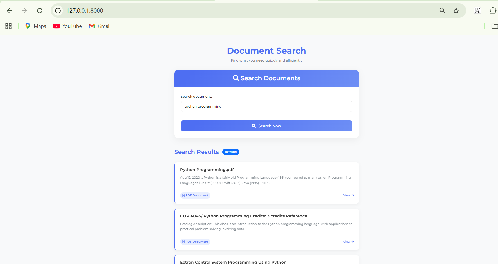

# Docs-Search

This project integrates the Google Custom Search API to perform advanced searches for different file type like PDF, DOCX etc with automatic key rotation. It allows admin to manage multiple API keys and Custom Search Engine (CSE) IDs directly from the django admin panel. When a key reaches its quota or encounters an error, the system automatically switches to the next available key, ensuring continuous search functionality.

## Screenshot


## Installation

### Prerequisites

- Python 3.x

- Django 3.x or later

- Google Custom Search API Key and CSE ID

### Steps

1. **Clone the repository:**

```bash
   git clone https://github.com/manishbhattrai/Docs-search.git
   cd Docs-search 
   ```


2. **Create and activate a virtual environment**

 
3. **Install dependencies:**

Navigate to the project directory and install required packages:

```bash
   pip install -r requirements.txt
   ```
4. **Set up .env file**

Copy and paste on the .env file:

```bash
   SECRET_KEY = enter your secret key.
```

5. **Set up Google API Keys and CSE IDs:**

In the Django admin, add your Google API keys and CSE IDs. The system will automatically rotate the keys when necessary.

6. **Run migrations:**

Apply database migrations to set up the necessary tables:

```bash
   python manage.py migrate
```

7. **Create super user**

Create super user for accessing django admin panel.
``` bash
    python manage.py createsuperuser
```

8. **Start the Django server**

Run the development server:

```bash
   python manage.py runserver
```

### Usage

**Admin Panel**

Navigate to the Django admin panel (/admin).

Add your Google API Keys and CSE IDs under the appropriate models.

The system will automatically rotate keys if one reaches its quota or fails.

